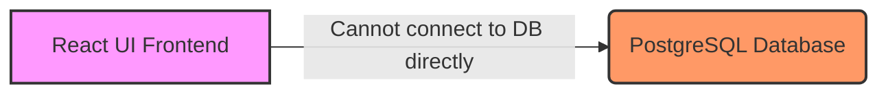
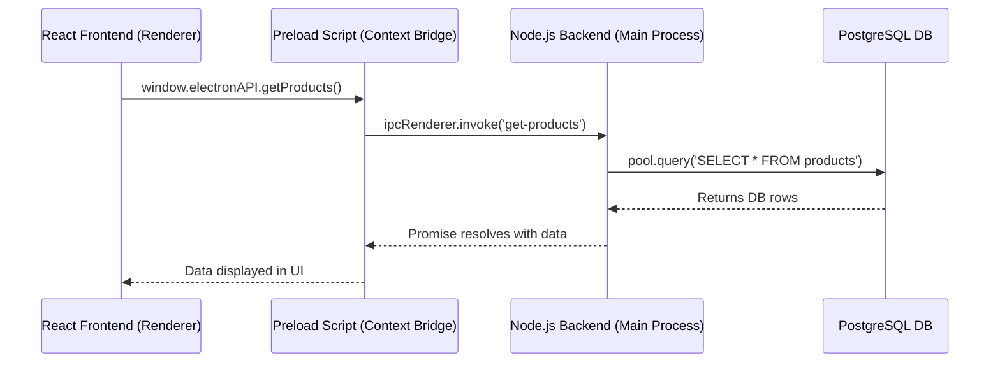

# PharmaX: Comprehensive Tutorial & Deep Dive

Welcome to the deep dive of **PharmaX**, a top-tier pharmaceutical billing, inventory sharing, and patient tracking system. This tutorial is designed for collaborators to quickly understand the core pillars of the application.

We will focus on three main architectural pillars:
1. **Dual-Process Electron Architecture**
2. **Inter-Process Communication (IPC)**
3. **High-Integrity PostgreSQL Database**

---

## 1. Dual-Process Electron Architecture

### 🔴 High Level What
PharmaX is a Desktop application built using Electron, but it doesn't run as a single monolithic block. It runs as two separate processes: the **Main Process** and the **Renderer Process**.

### 🟡 High Level Why
Separation of concerns and Security. If the UI (Renderer) gets compromised or runs malicious JavaScript, it cannot directly access the native OS file system or the PostgreSQL database.

### 🟢 High Level How
- **Renderer Process (`Frontend/`)**: A fast, Vite-bundled React Single Page Application handling the interactive UI and forms.
- **Main Process (`Backend/app/main.js`)**: A Node.js environment handling OS capabilities, the database connection pool (`pg`), and security (Argon2 hashing).

### 🔵 Why This Way (Tradeoffs)
We traded a simpler setup (e.g., everything running in a single web browser window talking to a remote REST API) for an offline-first, highly responsive desktop experience. The tradeoff is added complexity: the UI cannot directly run SQL queries; it must ask the Main Process to do it.



---

## 2. Inter-Process Communication (IPC)

### 🔴 High Level What
IPC is the bridge that allows the React UI to talk to the Node.js Main Process.

### 🟡 High Level Why
Since the Renderer is isolated, it needs a secure, structured way to request data (like "Get me all products") or trigger actions (like "Save this invoice").

### 🟢 High Level How
Electron provides a `preload.js` script that acts as a secure tunnel. It exposes a specific API (`window.electronAPI`) to the React frontend.

**Snippet 1: Frontend Request (React)**
```javascript
// From Frontend/src/pages/Products.jsx
// The frontend asks the backend for the products list
const all = await window.electronAPI.getProducts();
```

**Snippet 2: Backend Handler (Node.js Main Process)**
```javascript
// From Backend/app/main.js
// The backend listens for the 'get-products' event, queries the DB, and returns data
ipcMain.handle("get-products", async () => {
    const res = await pool.query("SELECT * FROM products WHERE is_active = TRUE");
    return { success: true, data: res.rows };
});
```

### 🔵 Why This Way (Tradeoffs)
Instead of exposing raw SQL execution to the frontend (which is an SQL injection nightmare), we define strict IPC channels (`get-products`, `add-purchase-invoice`). This strictly enforces API boundaries, similar to how REST endpoints work in web applications.



---

## 3. High-Integrity PostgreSQL Database

### 🔴 High Level What
The database is a robust, highly relational PostgreSQL schema configured for strict data integrity, utilizing advanced features like `JSONB` for flexible attributes and Pessimistic Locking.

### 🟡 High Level Why
In a pharmaceutical setting, a race condition that allows a batch to be oversold (negative stock) or a credit limit to be bypassed is catastrophic. The database must act as the ultimate source of truth and enforce business rules at the schema level.

### 🟢 High Level How
**1. Pessimistic Locking:** When processing an invoice, the system locks the specific records so no other process can touch them until the transaction finishes.
**2. JSONB Indexes:** Product metadata that might change shape is stored in JSONB columns, backed by GIN indexes for rapid searching.
**3. Soft Deletions:** We use `is_active` flags instead of `DELETE` to preserve historical audit trails.

**Snippet 3: Real-world Locking Example (Conceptual)**
```sql
BEGIN TRANSACTION;
-- Lock the customer record to check credit limit safely
SELECT credit_limit, balance_due FROM customers WHERE customer_id = $1 FOR UPDATE;

-- Lock the specific batch to safely deduct stock
SELECT quantity_available FROM batches WHERE batch_id = $2 FOR UPDATE;

-- Perform INSERTS and UPDATES
UPDATE batches SET quantity_available = quantity_available - $3;
COMMIT;
```

### 🔵 Why This Way (Tradeoffs)
Pessimistic locking (`FOR UPDATE`) reduces concurrent throughput (two cashiers selling the exact same batch of medicine might block each other for a few milliseconds). However, in a financial/pharmacy application, this tradeoff is actively desired to absolutely guarantee zero collisions and prevent negative inventory.

---
## Getting Started for New Collaborators
1. **Understand the DB first:** Look at `database/pharmax_schema.sql`. Understand the relationships between Products, Batches, and Invoices.
2. **Follow a single feature:** Trace how a Product is added. Start from `Frontend/src/pages/Products.jsx`, see how it calls `window.electronAPI.addProduct`, and trace it into `Backend/app/main.js` to see the SQL `INSERT`.
3. **Build the remaining features:** Look at the README Progress Report to see which User Stories remain (like Sales Returns or Ledgers) and use the existing IPC patterns to build them!
