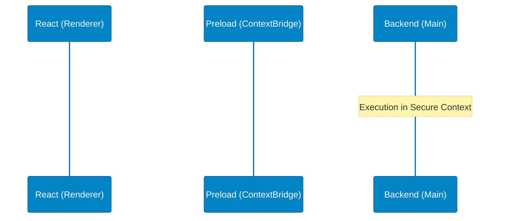

# Lesson 01: Core Architecture & IPC Boundaries

## 1. The 'Why': Isolation Over Convenience
PharmaX operates in a high-stakes retail environment. A single compromised frontend node cannot be permitted to execute arbitrary database payloads. We chose an **Isolated Dual-Process Architecture** over a monolithic local web server to establish an impenetrable boundary between presentation and persistent state.

## 2. The 'How': ContextBridge & IPC
The system is divided vertically:
- **Renderer Process (React/Vite):** Purely declarative UI. It has zero knowledge of the file system or PostgreSQL.
- **Preload Script:** The `ContextBridge`. It exposes a strictly whitelisted `window.electronAPI` interface.
- **Main Process (Node.js):** The authority. It receives IPC invokes, validates payloads, and executes `pg` queries.

## 3. The Tradeoffs & Black Swan Vulnerabilities
**Tradeoff:** Development velocity is reduced. Every new database operation requires boilerplate across three files (React component, Preload declaration, Main process handler).
**Overhead:** IPC serialization (structured clone algorithm) imposes a performance penalty for massive datasets.

**Black Swan Failure Mode: Memory Leaks via IPC Listeners**
If the frontend rapidly unmounts/remounts components that attach `ipcRenderer.on` listeners without cleanup, the Main process will experience a slow, cascading memory leak leading to an OOM (Out of Memory) crash.

### 4. Hardening & Rectification
- **Strict Typing:** Enforce TypeScript interfaces on the IPC boundary to prevent malformed payloads crashing the Node process.
- **Handler Batching:** Implement batch IPC handlers (`get-dashboard-data`) instead of firing 15 simultaneous IPC requests on component mount.
- **Event Cleanup:** Avoid bidirectional IPC push streams where possible; prefer the `invoke/handle` Promise paradigm which naturally garbage-collects upon resolution.
