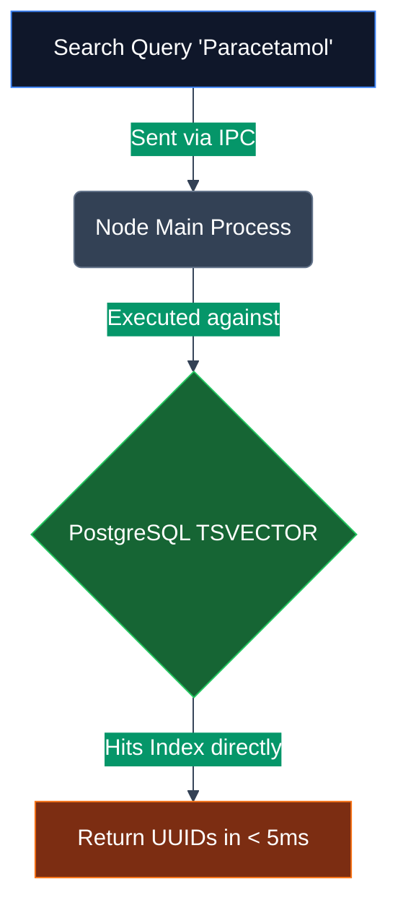

# Lesson 03: Inventory & Intelligence

## 1. The 'Why': Schema Evolution & Speed
Pharmaceutical products carry wildly differing metadata (e.g., syrups have volume, tablets have blister counts, specific drugs have DRAP-specific refrigeration attributes). Forcing this into rigid relational columns creates a sparse, brittle schema. We require NoSQL-like flexibility coupled with relational reporting power.

## 2. The 'How': JSONB & GIN Indexing
PharmaX leverages PostgreSQL's `JSONB` data type for the `attributes` column on the `products` table. To ensure this doesn't become a performance bottleneck, we index these structures using a **GIN (Generalized Inverted Index)**.

For instantaneous searching across tens of thousands of generic formulas and brand names, the schema employs `TSVECTOR` full-text search columns updated via triggers.

## 3. The Tradeoffs & Black Swan Vulnerabilities
**Tradeoff:** Write Amplification. Every time a product is updated, PostgreSQL must unpack the JSONB tree, update it, serialize it, and heavily modify the GIN/TSVECTOR indices. Writes become significantly more expensive than standard row updates.

**Black Swan Failure Mode: GIN Index Bloat & WAL Exhaustion**
If a high-frequency background job continuously mutates JSONB attributes, the GIN index will rapidly bloat. Because PostgreSQL uses MVCC (Multi-Version Concurrency Control), the disk space consumed by the index can explode to multiple gigabytes, eventually triggering an ENOSPC (No Space Left on Device) kernel panic, taking the entire database offline.

### 4. Hardening & Rectification
- **Shallow JSONB Design:** Restrict JSONB to a maximum depth of 2 levels. Do not store highly volatile state (like stock counts) inside JSONB; reserve it strictly for static, read-heavy metadata.
- **Index Maintenance Routine:** Implement a CRON trigger (or Node-side scheduled job) to execute `REINDEX INDEX CONCURRENTLY` on the GIN indices during off-peak hours (e.g., 3:00 AM) to clear the bloat without locking out read queries.
- **Targeted Updates:** Use the `jsonb_set` function for partial updates rather than overwriting the entire JSONB column, minimizing WAL write size.
