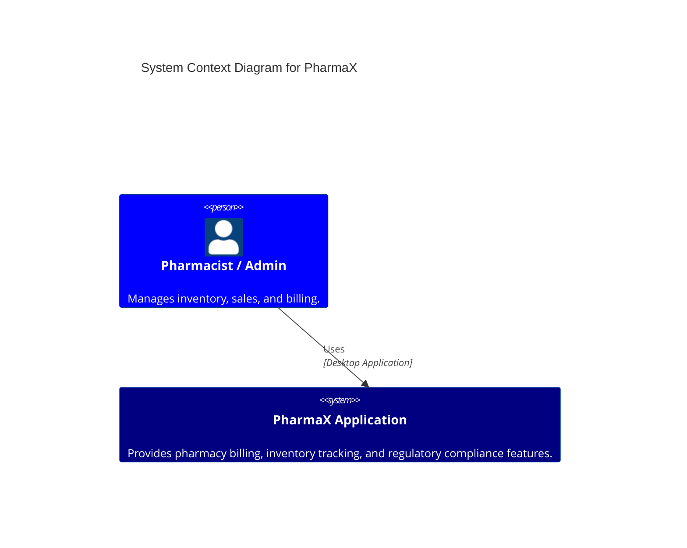
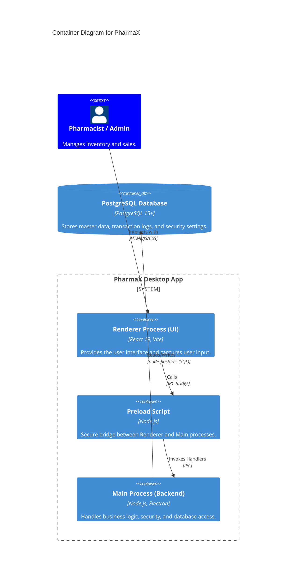
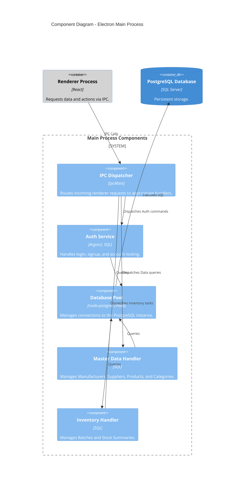

# PharmaX C4 Model Diagrams

This document provides a visual representation of the PharmaX architecture using the C4 Model (Context, Container, Component).

## Level 1: System Context Diagram

The System Context diagram shows the PharmaX application in the context of the business environment.

---

## Level 2: Container Diagram

The Container diagram shows the high-level technical building blocks of the PharmaX application.

---

## Level 3: Component Diagram (Main Process)

The Component diagram decomposes the Main Process into its internal functional components.

