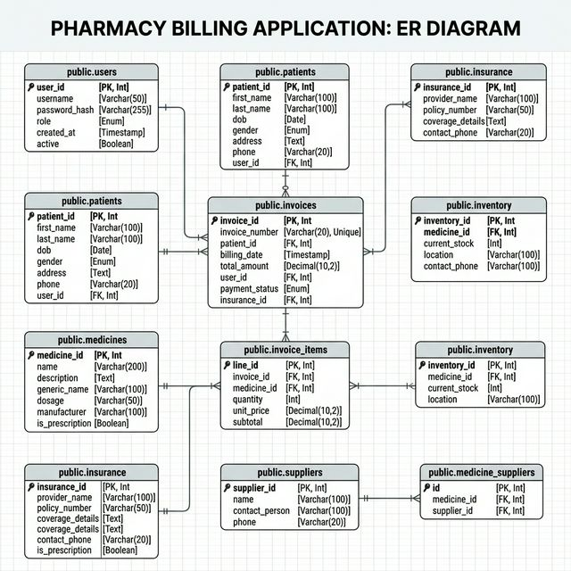

# Pharmacy Billing App

## Description
A comprehensive and top-tier pharmaceutical billing, inventory sharing, and patient tracking system built on modern architectural principles. This system guarantees financial integrity using pessimistic locking, JSONB indexes, and robust Electron inter-process communication—all backed by an industrial-grade PostgreSQL schema tailored for zero-collision concurrency.

## Team Members
- Student Name 1 (Roll No.)
- Student Name 2 (Roll No.)

## Tech Stack
- **Backend**: Node.js (Electron Main Process)
- **Frontend**: React (Vite, Electron Renderer & Shadcn/Radix Primitives)
- **Database**: PostgreSQL

---

## 🏗️ Architecture Overview

The application features a secure and modern dual-process desktop architecture:

### 1. Dual-Process Electron Pattern
* **Main Process (`Backend/app/`)**: Handles native OS capabilities, deep PostgreSQL connections, and manages the secure window sandbox.
* **Renderer Process (`Frontend/`)**: A fast, Vite-bundled React Single Page Application handling the interactive UI and forms. 
* **IPC (Inter-Process Communication)**: Ensures strict API boundaries so the frontend cannot execute arbitrary queries, neutralizing SQL injection vectors.

### 2. High-Integrity PostgreSQL Database 
* **Credit Race Condition Guards**: Transactions utilize pessimistic locking (`SELECT ... FOR UPDATE`) to guarantee zero balance limits aren't violated.
* **Metadata Performance**: Clinical data models utilize `.jsonb` columns backed by `GIN` indexes, creating a NoSQL-like search speed inside a relational system.
* **Collision-Free Invoicing**: Strict sequences ensure continuous and scalable sequential identifiers for financial tracking.

---

## 🗄️ Database ERD

*The database topology for the application is designed comprehensively around financial transactions, medicine inventory, and patient tracking:*



---

## 🚀 How to Run

### Database
1. Make sure you have **PostgreSQL 14+** running locally.
2. Initialize the database schema:
   ```bash
   psql -U postgres -f database/pharmax_schema.sql
   ```
3. Copy `.env.example` (if exists) to `Backend/app/.env` holding your local `DATABASE_URL`.

### Backend (Node.js/Electron Main)
*Note: In Electron via Forge, building the main process is often handled simultaneously by the frontend bundler, but if independent:*
```bash
cd Backend/app
npm install
```

### Frontend (React/Electron Shell)
Starts the entire desktop application by launching the Vite development server paired with the Electron harness:
```bash
cd Frontend
npm install                                                                                                              
npm start   
```

---

## 🛠️ Testing & Quality

* **TypeScript / React 19 Patterns**: Stale closures inside `useEffect` and anti-patterns like `dangerouslySetInnerHTML` are strictly forbidden. Hooks follow strict dependency arrays, and components are efficiently memoized.
* **SQL Linters**: Schema triggers, procedures, and logic flows adhere to official GitHub PostgreSQL guidelines.
* **Security Scans**: The architecture conforms to SOLID boundaries, preserving separation of concerns across the Node.js API layer.

## 🚑 Troubleshooting

- **`could not connect to server: Connection refused`**: Start your PostgreSQL daemon (`pg_ctl start` or system services).
- **`Vite Build failed` / `Electron Not Starting`**: Run `rm -rf node_modules/.vite` to purge the bundler cache and re-run `npm install`.
