# SE Deliverable #3 — Design Diagrams

## Pharmacy Billing App

**Tech Stack:** Electron (Node.js Main Process) · React 19 + Vite (Renderer) · PostgreSQL 14+  
**Architecture Style:** Dual-Process Electron (Layered + Client–Server within a desktop shell)

---

## 1. Architecture Diagram

_Architecture Style: **Layered Architecture** within an **Electron dual-process model**. The Renderer (UI) is strictly isolated from the Main (backend) process via IPC — no direct DB access from the UI, enforcing separation of concerns and preventing SQL injection._

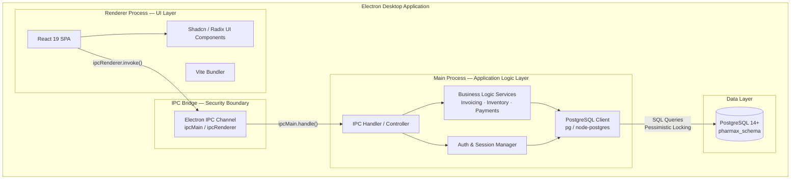

---

## 2. Component Diagram

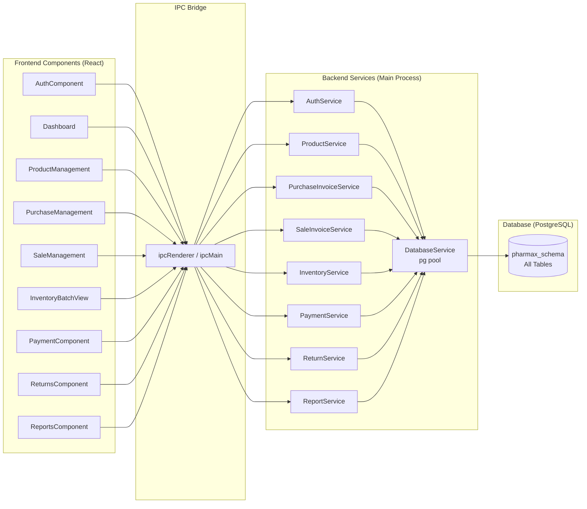

---

## 3. Data Flow Diagrams

### DFD Level 0 — Context Diagram

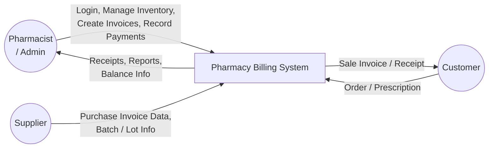

---

### DFD Level 1 — Main Processes

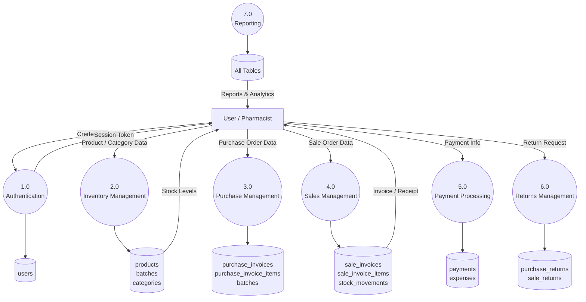

---

### DFD Level 2 — Sales Management (Process 4.0 Drill-down)

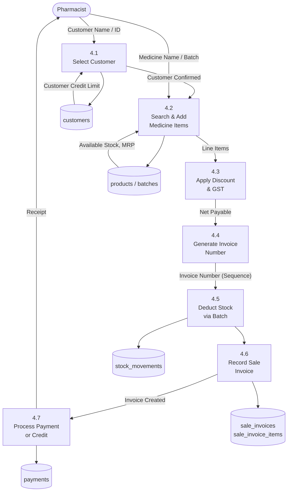

---

## 4. Activity Diagrams

### Activity 1 — Create Sale Invoice

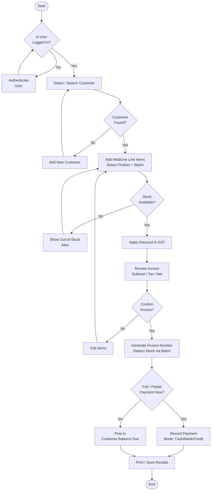

---

### Activity 2 — Process Purchase Invoice

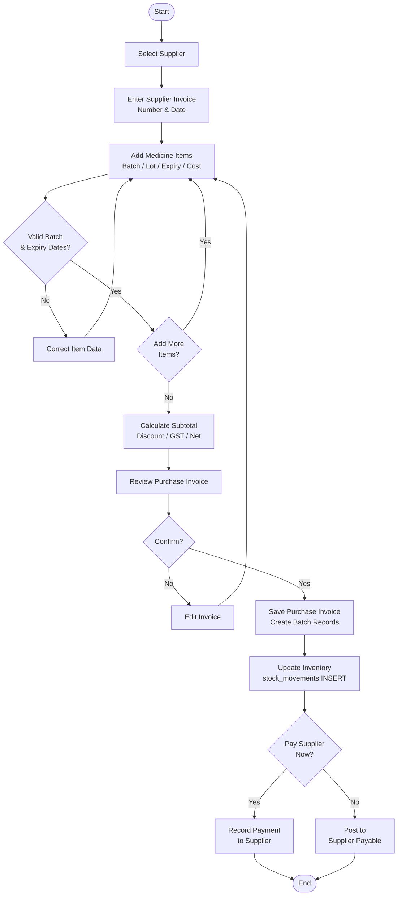

---

### Activity 3 — Record a Payment

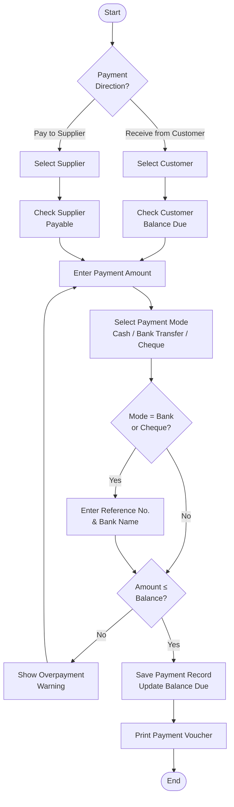

---

## 5. Use Case Diagram

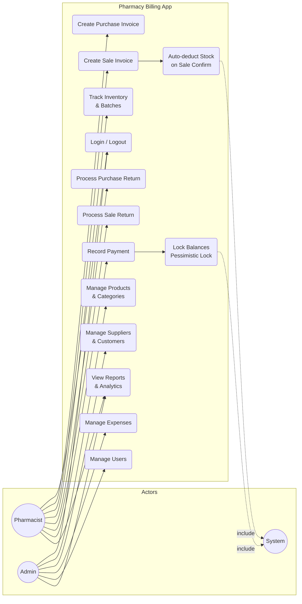

---

## 6. Sequence Diagrams

### Sequence 1 — Create Sale Invoice

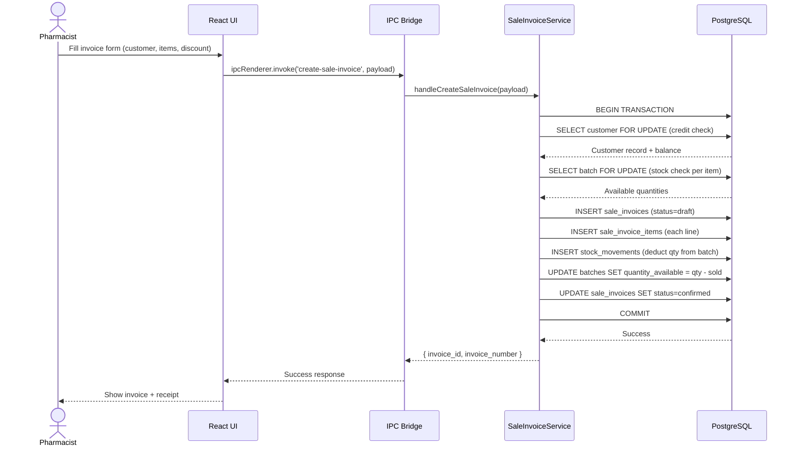

---

### Sequence 2 — Process Purchase Invoice

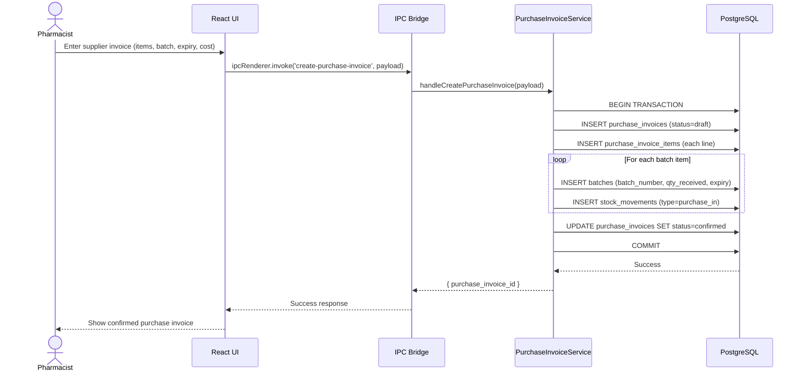

---

### Sequence 3 — Record Payment

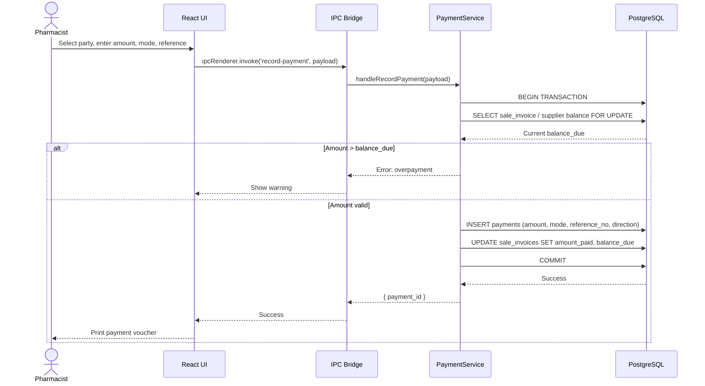

---

## 7. Class Diagram

_Derived from the PostgreSQL schema in `database/pharmax_schema.sql`._

```mermaid
classDiagram
    class User {
        +UUID user_id
        +String username
        +String password_hash
        +Boolean is_active
        +DateTime last_login_at
        +Int failed_attempts
        +DateTime locked_until
        +login()
        +logout()
    }

    class Manufacturer {
        +UUID manufacturer_id
        +String name
        +String drap_mfg_licence
        +String country
        +String contact_number
        +String email
        +Boolean is_active
    }

    class Category {
        +UUID category_id
        +String name
        +String description
        +Boolean is_active
    }

    class Product {
        +UUID product_id
        +UUID manufacturer_id
        +UUID category_id
        +String name
        +String form
        +String uom
        +Int quantity_in_uom
        +Decimal gst_rate
        +String drug_schedule
        +Boolean requires_prescription
        +String generic_formula
        +Decimal default_sale_rate
        +Decimal default_purchase_rate
        +JSONB attributes
        +Boolean is_active
        +updatePrice()
        +checkStock()
    }

    class ProductPriceHistory {
        +UUID history_id
        +UUID product_id
        +UUID changed_by
        +Decimal default_sale_rate
        +Decimal default_purchase_rate
        +DateTime effective_from
        +String notes
    }

    class Supplier {
        +UUID supplier_id
        +String name
        +String strn
        +String ntn
        +String drug_licence_no
        +Decimal opening_balance
        +Int credit_period_days
        +Boolean is_active
        +getBalance()
    }

    class Customer {
        +UUID customer_id
        +String name
        +String strn
        +CustomerType customer_type
        +Decimal credit_limit
        +Decimal opening_balance
        +Boolean is_active
        +checkCreditLimit()
        +getBalanceDue()
    }

    class ContactPerson {
        +UUID contact_id
        +EntityType entity_type
        +UUID entity_id
        +String name
        +String role
        +String contact_number
        +Boolean is_primary
    }

    class Batch {
        +UUID batch_id
        +UUID product_id
        +UUID supplier_id
        +UUID purchase_invoice_id
        +String batch_number
        +Date expiry_date
        +Decimal mrp
        +Decimal purchase_cost_per_unit
        +Int quantity_received
        +Int quantity_available
        +Boolean is_active
        +isExpired()
        +deductStock(qty)
    }

    class StockMovement {
        +UUID movement_id
        +UUID batch_id
        +MovementType movement_type
        +Int quantity
        +String reference_type
        +UUID reference_id
        +UUID created_by
    }

    class PurchaseInvoice {
        +UUID purchase_invoice_id
        +UUID supplier_id
        +String invoice_number
        +Date invoice_date
        +InvoiceStatus status
        +Decimal subtotal
        +Decimal discount_amount
        +Decimal tax_amount
        +Decimal net_payable
        +UUID created_by
        +confirm()
        +calculateTotals()
    }

    class PurchaseInvoiceItem {
        +UUID item_id
        +UUID purchase_invoice_id
        +UUID product_id
        +String batch_number
        +Date expiry_date
        +Decimal mrp
        +Decimal purchase_cost_per_unit
        +Int quantity
        +Decimal discount_pct
        +Decimal gst_rate
        +Decimal line_total
    }

    class SaleInvoice {
        +UUID sale_invoice_id
        +String invoice_number
        +UUID customer_id
        +Date invoice_date
        +Date due_date
        +InvoiceStatus status
        +Decimal subtotal
        +Decimal discount_amount
        +Decimal tax_amount
        +Decimal net_receivable
        +Decimal amount_paid
        +Decimal balance_due
        +UUID created_by
        +confirm()
        +calculateTotals()
        +applyPayment(amount)
    }

    class SaleInvoiceItem {
        +UUID item_id
        +UUID sale_invoice_id
        +UUID product_id
        +UUID batch_id
        +Int quantity
        +Decimal mrp
        +Decimal sale_rate
        +Decimal discount_pct
        +Decimal line_total
    }

    class PurchaseReturn {
        +UUID return_id
        +UUID purchase_invoice_id
        +UUID supplier_id
        +Date return_date
        +ReturnReason reason
        +Decimal total_credit
        +InvoiceStatus status
        +process()
    }

    class SaleReturn {
        +UUID return_id
        +UUID sale_invoice_id
        +UUID customer_id
        +Date return_date
        +ReturnReason reason
        +Decimal total_credit
        +InvoiceStatus status
        +process()
    }

    class Payment {
        +UUID payment_id
        +PaymentDirection direction
        +UUID party_id
        +Date payment_date
        +Decimal amount
        +PaymentMode mode
        +String reference_no
        +UUID created_by
        +validate()
    }

    class Expense {
        +UUID expense_id
        +Date expense_date
        +ExpenseCategory category
        +String description
        +Decimal amount
        +PaymentMode mode
        +UUID created_by
    }

    %% Relationships
    Manufacturer "1" --> "0..*" Product : manufactures
    Category "1" --> "0..*" Product : classifies
    Product "1" --> "0..*" ProductPriceHistory : tracks
    User "1" --> "0..*" ProductPriceHistory : changedBy

    Supplier "1" --> "0..*" PurchaseInvoice : supplies
    PurchaseInvoice "1" --> "1..*" PurchaseInvoiceItem : contains
    Product "1" --> "0..*" PurchaseInvoiceItem : referencedIn

    Product "1" --> "0..*" Batch : stockedAs
    Supplier "1" --> "0..*" Batch : sourcedFrom
    PurchaseInvoice "1" --> "0..*" Batch : receivedOn

    Batch "1" --> "0..*" StockMovement : tracks
    User "1" --> "0..*" StockMovement : records

    Customer "1" --> "0..*" SaleInvoice : billedTo
    SaleInvoice "1" --> "1..*" SaleInvoiceItem : contains
    Product "1" --> "0..*" SaleInvoiceItem : referencedIn
    Batch "1" --> "0..*" SaleInvoiceItem : dispatchedFrom

    PurchaseInvoice "1" --> "0..*" PurchaseReturn : returnedAgainst
    SaleInvoice "1" --> "0..*" SaleReturn : returnedAgainst

    Supplier "1" --> "0..*" ContactPerson : hasContact
    Customer "1" --> "0..*" ContactPerson : hasContact

    User "1" --> "0..*" Payment : records
    User "1" --> "0..*" Expense : records
    User "1" --> "0..*" SaleInvoice : creates
    User "1" --> "0..*" PurchaseInvoice : creates
```

---

_End of Design Diagrams — SE Deliverable #3_
