# PharmaX — SE Deliverable 3: Design Diagrams

**Sprint 2 | Pharmacy Billing Application**

---

## 2a. Architecture Diagram

### Architecture Styles Used

PharmaX employs **two complementary architecture styles**:

1. **Layered (N-Tier) Architecture** — The system is divided into three strict tiers: Presentation (React Renderer), Business Logic (Electron Main Process), and Data (PostgreSQL). Each layer only communicates with the layer directly below it.

2. **Client-Server Architecture** — Within the desktop application, the React Renderer Process acts as the "client" and the Electron Main Process acts as the "server". All data requests originate from the client and are fulfilled by the server over a strict IPC channel.

**Rationale:** The Layered pattern enforces Separation of Concerns — the UI cannot directly query the database, which eliminates SQL injection at the renderer boundary. The Client-Server model maps naturally to Electron's security model (`contextIsolation: true`), where the Preload Script acts as a controlled API gateway between untrusted renderer JavaScript and the privileged Node.js main process.

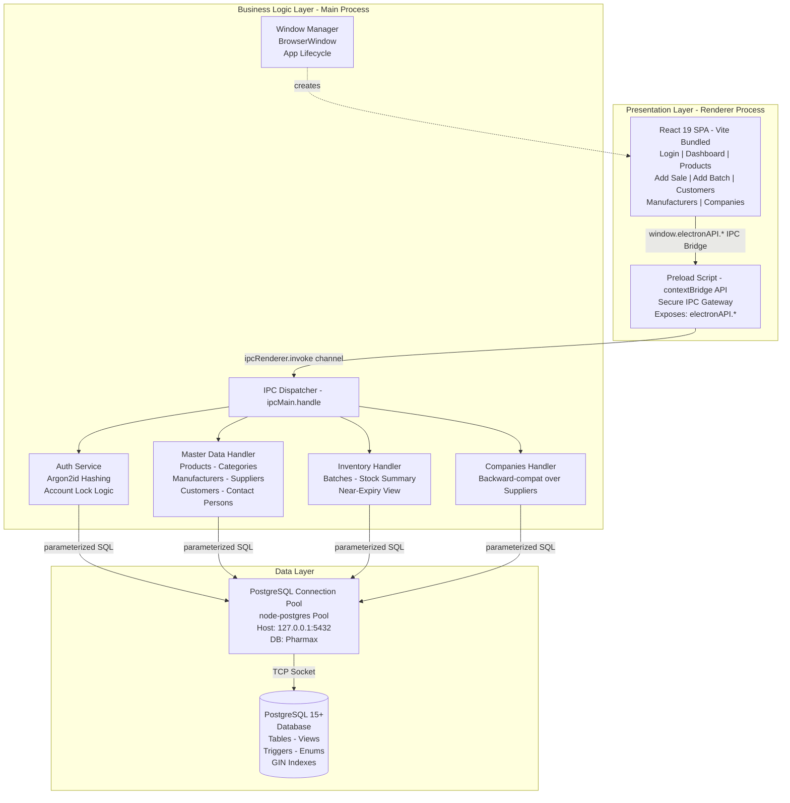

---

## 2b. Component Diagram

```mermaid
graph LR
    subgraph Frontend["Frontend - Renderer Process"]
        direction TB
        APP["App.jsx\nRoot Component\nRouter + Auth Guard"]

        subgraph Pages["Pages"]
            LOGIN["Login.jsx"]
            SIGNUP["Signup.jsx"]
            DASH["Dashboard.jsx"]
            ADDSALE["AddSale.jsx"]
            ADDBATCH["AddBatch.jsx"]
            PRODUCTS["Products.jsx"]
            CUSTOMERS["AddCustomers.jsx"]
            COMPANIES["Companies.jsx"]
            MANUFACTURER["Manufacturer.jsx"]
            AREAS["AddArea.jsx"]
        end

        subgraph Components["Shared Components"]
            SIDEBAR["Sidebar.jsx\nNav + Logout"]
            HEADER["Header.jsx"]
            CMD["Command.jsx\nCtrl+J Search"]
            STATS["StatsPanel.jsx"]
            CHART["AnalyticsChart.jsx"]
            ACTIVITY["ActivityList.jsx"]
        end
    end

    subgraph Bridge["IPC Bridge"]
        PRELOAD["preload.js\ncontextBridge\nwindow.electronAPI"]
    end

    subgraph Backend["Backend - Main Process"]
        MAIN["main.js\nElectron Main"]
        subgraph Handlers["IPC Handlers - ipcMain.handle"]
            H_AUTH["Auth Handlers\nlogin-user\nsignup-user"]
            H_MFR["Manufacturer Handlers\nget/add/update/deactivate/reactivate"]
            H_CAT["Category Handler\nget-categories"]
            H_PROD["Product Handlers\nget-products / getProducts\nadd/update/deactivate/reactivate"]
            H_SUP["Supplier Handlers\nget/add/update/deactivate/reactivate"]
            H_CUST["Customer Handlers\nget/add/update/delete/reactivate"]
            H_CONTACT["Contact Person Handlers\nget/add/delete-contact-person"]
            H_BATCH["Batch Handlers\nget-batches\nadd-batch"]
            H_STOCK["Stock Handlers\nget-stock-summary\nget-stock-by-product\nget-near-expiry"]
            H_COMP["Company Handlers\nget-companies\nadd-company"]
            H_GEN["Generic DB Handlers\nquery-db\nrun-db"]
        end
        DBPOOL["PostgreSQL Pool\nnode-postgres"]
    end

    subgraph DB["Database"]
        POSTGRES[("PostgreSQL\nPharmax DB")]
    end

    APP --> Pages
    APP --> Components
    Pages -->|"window.electronAPI.*"| PRELOAD
    PRELOAD -->|"ipcRenderer.invoke"| Handlers
    Handlers --> DBPOOL
    DBPOOL -->|SQL| POSTGRES
    MAIN --> Handlers
    MAIN --> DBPOOL
```

---

## 2c. Data Flow Diagrams

### DFD Level 0 — Context Diagram

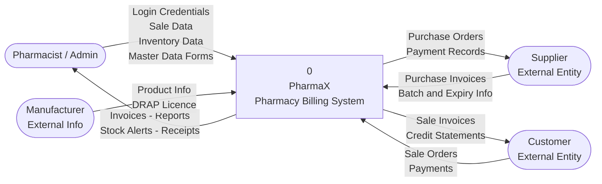

---

### DFD Level 1 — Main Processes

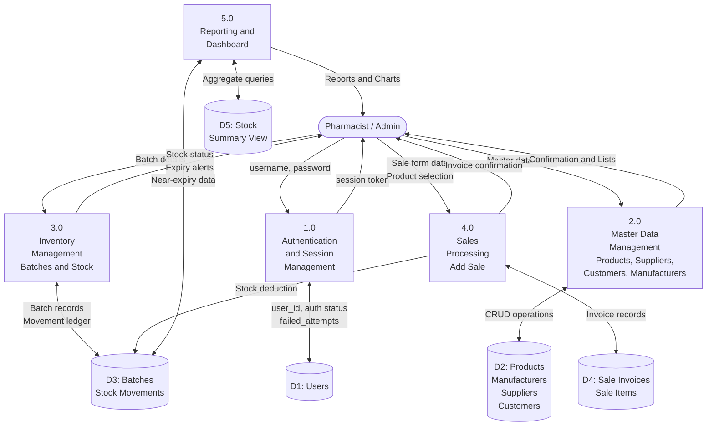

---

### DFD Level 2 — Process 1: Authentication Detail

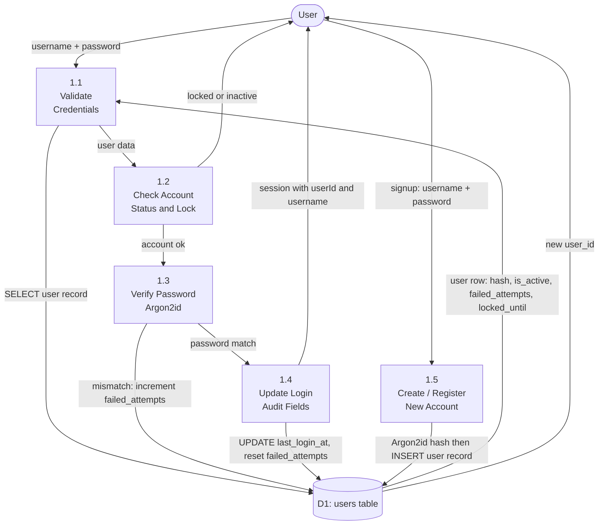

---

### DFD Level 2 — Process 3: Inventory Management Detail

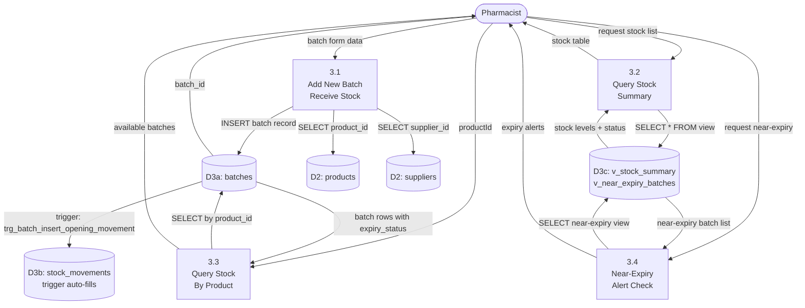

---

## 2d. Activity Diagrams

### Activity Diagram 1: User Login Process

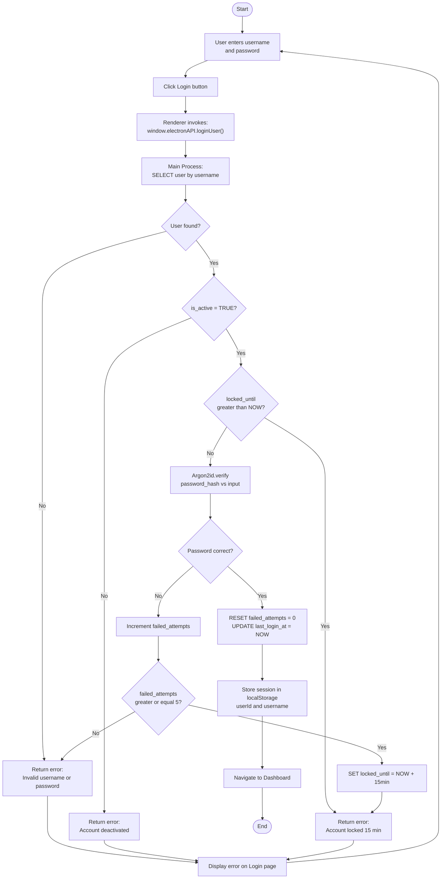

---

### Activity Diagram 2: Add Sale Process

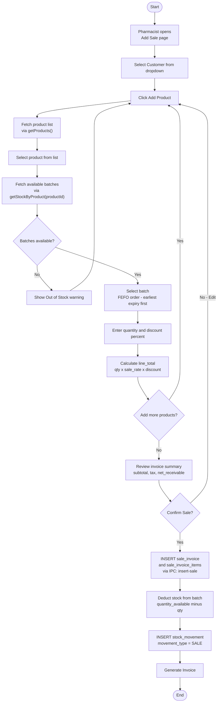

---

### Activity Diagram 3: Add Batch (Receive Inventory)

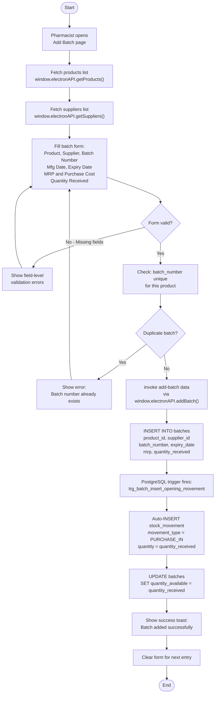

---

## 2e. Use Case Diagram

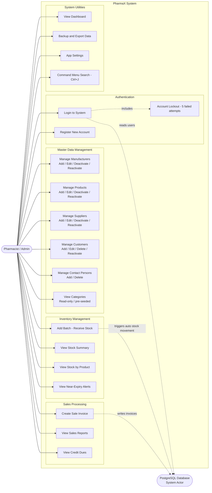

---

## 2f. Sequence Diagrams

### Sequence Diagram 1: User Login

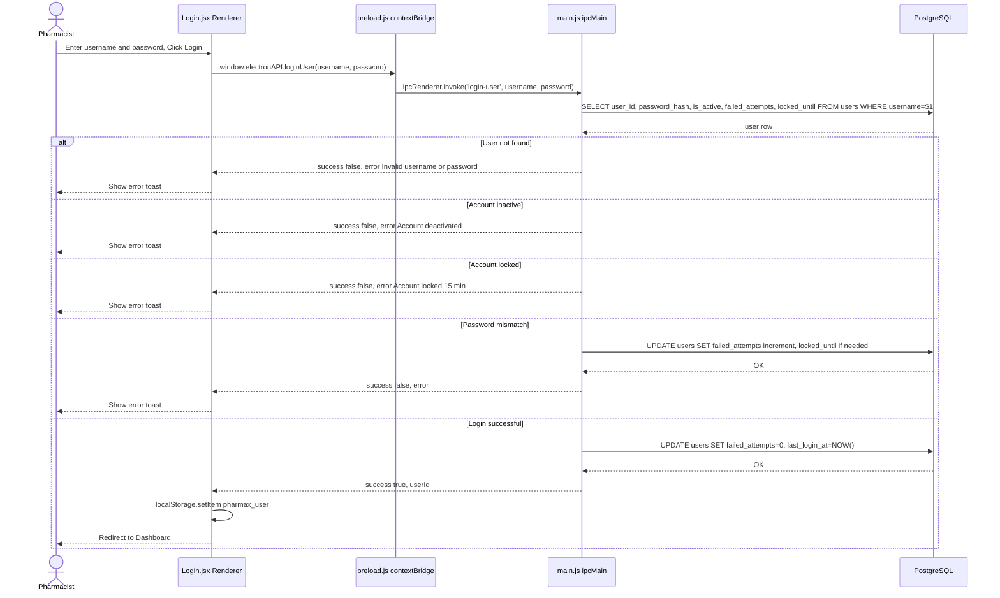

---

### Sequence Diagram 2: Add Sale Invoice

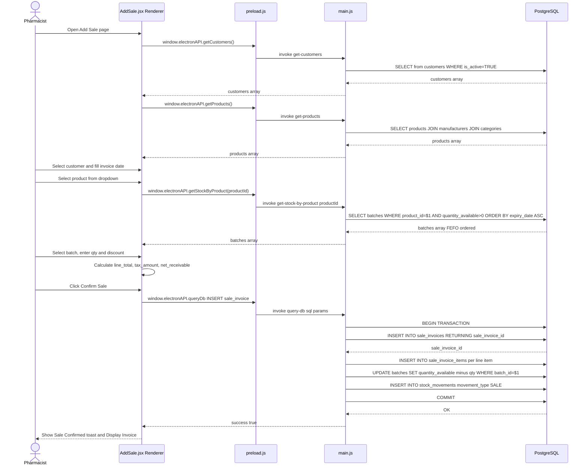

---

### Sequence Diagram 3: Add Batch (Receive Inventory)

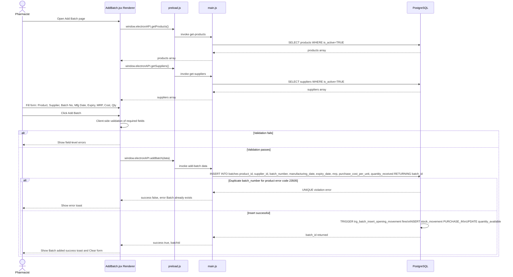

---

## 2g. Class Diagram

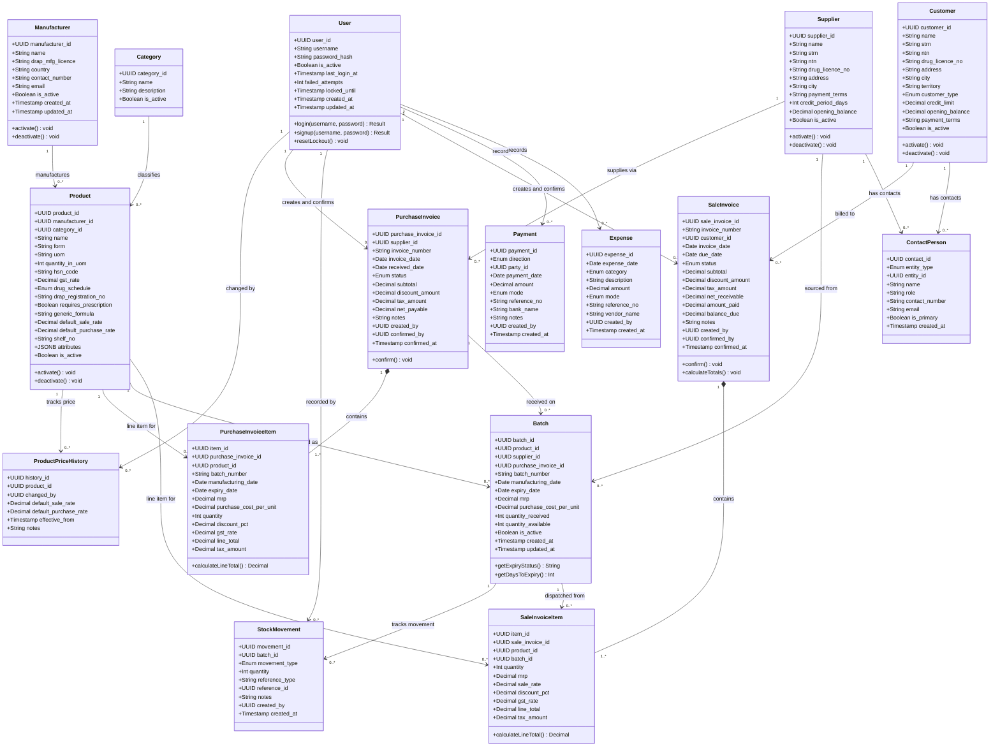

---

_Generated from codebase analysis: `Backend/app/main.js`, `Backend/app/preload.js`, `Frontend/src/App.jsx`, `Frontend/src/components/Sidebar.jsx`, `database/pharmax_schema.sql` ERD, `Docs/architecture/ARCHITECTURE.md`, and `README.md`._
